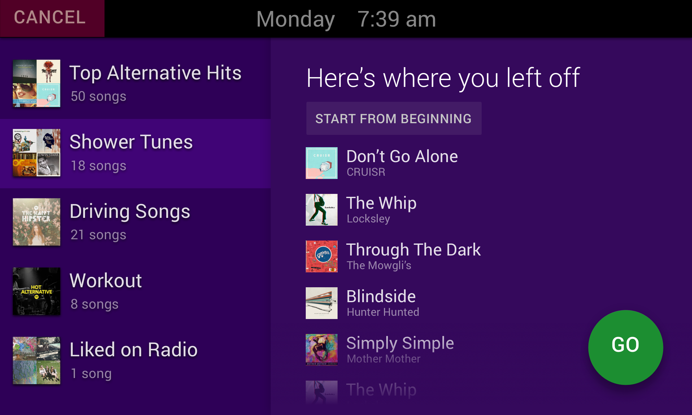

# Soapy

Soapy is a project to let people in my dorm, the [Computer Science House](https://csh.rit.edu),
listen to music in the showers effortlessly. Step into the shower stall, tap your RFID card, and
dance to your Spotify tunes raining down from the ceiling.

The research, design, and mockups are hosted in a separate
[Google Drive folder](https://drive.google.com/open?id=0B7U_glV0MPfXfk9ydy1jYjhJZ1R5U1FQYXdUdUxoV25rV0IxV0EzVTA0S09EeXJ3U2ZqUlE).

### The Plan

The project started with a thorough survey of most of our ~80 members. [The results](https://drive.google.com/open?id=1Nxg_HerX3r56k5voLLy-E5I_NpizRvRGyskCTjeIZWg)
show that initially supporting Spotify playlists will make the project valuable to most people.

Check out the [design document](https://drive.google.com/open?id=1dm209j92HQtXiIEVkRiSVtIVZ2bBCVd0NnJlYBiv1xg)
for a more detailed explanation why and how I'm solving the problem of listening to music in our showers.

### The Design

There are six bathrooms on-floor. Most of them consist of two independent shower stalls, which will have
one in-ceiling speaker shared between them. Within each stall is a door lock sensor and an RFID reader.

Mounted on the wall *outside* the bathroom is a small tablet running the Soapy UI. Interacting with this
tablet begins with tapping your RFID card on a third reader mounted next to the tablet.

The purpose of the tablet UI is to provide an easy way for people to choose a different Spotify playlist to
use for their showers without having to log on to their phone or computer in the morning. Using the tablet
is only neccessary when choosing a different playlist than used previously.

The tablet also has a second and more functional purpose: It provides the brains for each bathroom. The only
official way to play Spotify music is to use their iOS or Android SDK, so the tablet app is an Android app.
Moreover, the tablet connects to the Arduino which bridges the door sensors and RFID readers with the tablet.

The tablet UI mockups are in a [Sketch file](https://drive.google.com/open?id=0B7U_glV0MPfXTW5wZW9XZjRKSTg).

# This repository

I initially had separate repositories for the website and for the android (tablet) app, but keeping those in sync
was becoming cumbersome, and it was unclear which repo people should post issues. So I've consolidated!

Think of each top-level directory as a separate project. Each has their own README.md. Check them out!

- **[Web](Web)**: The website for Soapy, which serves as a way for Computer Science House members to pair their CSH with
           their Spotify account. It also serves as an API for the tablets to query for user info and get Spotify
           access tokens.
- **[Android](Android)**: The tablet app that plays the music for each bathroom, listens to the bathroom hardware, and enables
               easy changing of Spotify playlist selections.
- **[CAD](CAD)**: The 3D models for Soapy's housing components. The only current models are for the boxes to contain the
           in-shower RFID readers and protect them from water.
- **[Arduino](Arduino)**: The code for the Arduinos which interface with each tablet.

--

